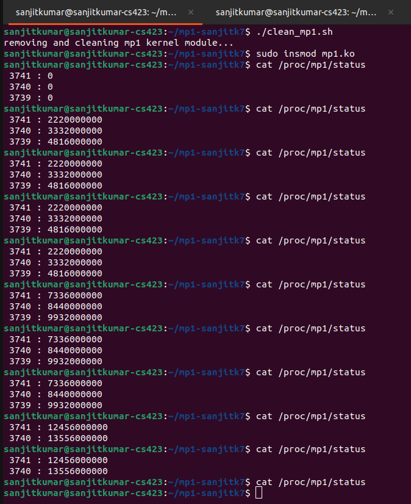

# CS 423 - MP1 - Introduction to Linux Kernel Programming

## How to run

```
make
sudo insmod mp1.ko
./userapp (run multiple in multiple terminal tabs)
cat /proc/mp1/status
sudo rmmod mp1
```

### Alternatively, use scripts

**insert.sh** inserts mp1.ko, checks dmesg and runs one instance of userapp
**cleanup.sh** removes the kernel module and clears dmesg

```
make
./insert.sh
*run more userapp instances from other terminals*
./cleanup.sh
```

## Working

### Architecture


### Userapp to Mp1 Kernel Module Interaction

The userapp process accesses the kernel mp1 module via the proc filesystem. Whenever the userapp reads or writes to the /proc/mp1/status file the corresponding myread and mywrite callbacks are called. These write adds the userapp process's pid to a mp1 kernel linked list with usertime=0. The read callback reads all previously registered entries from the list. Copying to and from user is done using syscalls and a buffer. A mutex is used to lock the linked list during read and write.

### Storing Process Information

Process information is stored inside a doubly linked linux linked list. The nodes each have a int pid and an unsigned long usercputime. This datastructure is accessed in proc read and write callbacks and also in timer callback to increment the cpu time.

### Periodic CPU time update and kernel workqueue

The updates to the cpu time inside the linked list nodes are done by 'get cpu use' in the bottom half of the top-down approach adopted. On process completion the bottom half also unregisters the process (deletes list node). A kernel timer is used to for the periodic interrupts (units of jiffies and seconds) are converted as needed. 

A linux kernel workqueue is used to update the cpu time. The timer handler in fact adds the work to the workqueue that in turn get executed in individual kernel threads. The timer is reset to expire at 5 secs every time the timer handler is called (making it check the list infinitely)

A mutex is used to lock and unlock the linked list in the work function when the time is updated.

### Sample Output

