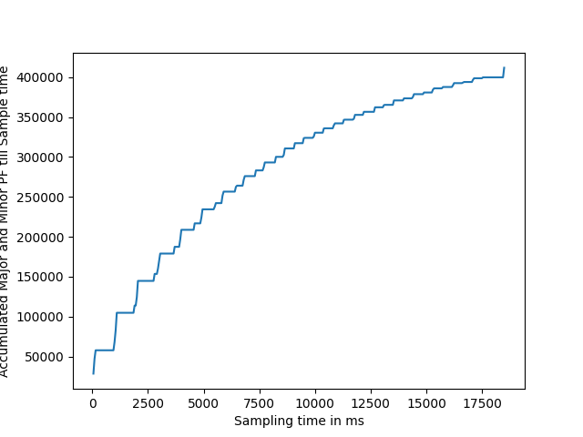
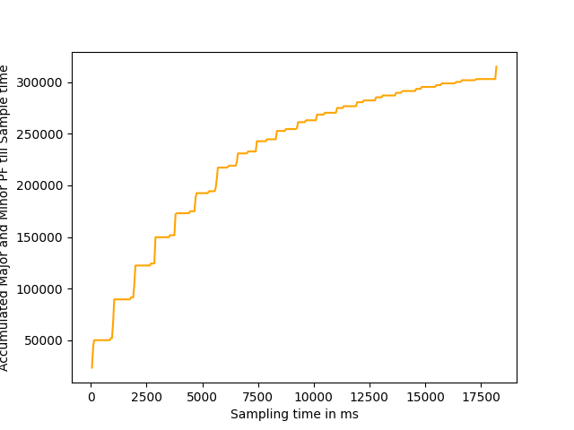
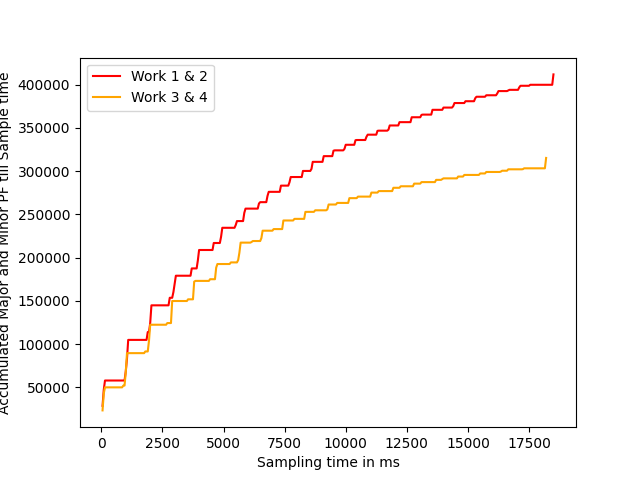
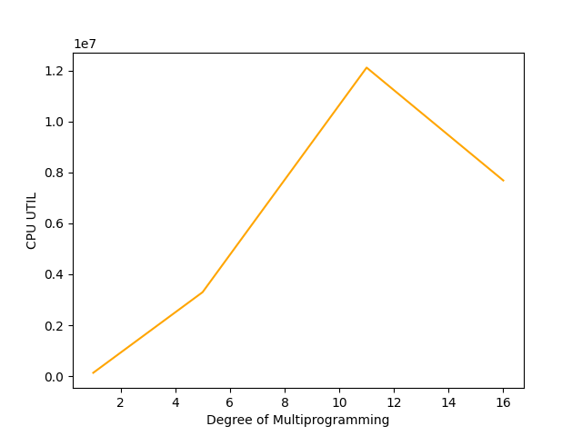

# MP3-PageFaultProfiler

## Design and Working

A virtual page fault profiler is implemented that resides in the kernel space and profiles the page faults (both major and minor) and cpu run times of the registered work processes (user processes) and writes the data at a specified sampling rate (here 20 samples per second implying 1 sample/50ms ) to a virtual memory buffer. This memory appears to be contiguous to a different user process (via virtual memory) but is actually non-contiguous physical memory (vmalloc is used for this purpose). The sampling at regular intervals is also implemented via a delayed work queue (instead of the regular workqueue with manual timer setup used in MP1).

Registration and De-registration of the user work processes is done via the proc interface switch cases. The workqueue job (that does the sampling and writing to common memory space) is created when the first user process registers itself and the workqueue job is flushed and deleted when the last work process finishes its execution (and deregisters itself).

The profiled data is read by a separate monitor process that resides in the user space. This process uses a character device driver in the kernel profiler module to map the shared virtual memeory buffer to its own address space. A mmap callback in the profiler module helps do this by sequentially iterating over the monitor virtual memory address and mapping the pages. The major and minor device numbers used for the character device driver are as specified on Piazza - 423 and 0 respectively.

This data is later pulled by the monitor process and written to different profile{number}.dat files for different test cases. Plots from these data files are used for the case study analysis.

## Key Implementation API
- Delayed Workqueue Implementation from \<linux/workqueue.h>
- Storing registered user processes in linux doubly linked lists \<linux/list.h>
- Creating and writing to virutal memory buffer \<linux/vmalloc.h>
- Creating character device interface, registering/initializing the device number using register_chrdev_region, MKDEV, cdev_init, cdev_add from \<linux/cdev.h> and <linux/kdev_t.h>
- Getting physical page of virual memory buffer and remapping to physical address of user process with the help of vmalloc_to_pfn and remap_pfn_range from \<linux/mm.h>

## How to Run

First use the insert.sh script to insert the profiler kernel module and run corresponding test command with work processes. Use monitor program to write profiled data to file. Or do.

```
make
sudo insmod mp3.ko
sudo mknod node c 423 0
sudo chmod 666 node
nice ./work 1024 R 50000 & nice ./work 1024 R 10000 
<Or any other test command>
./monitor > profile1.dat
```

Run case_study python scripts to generate plots.
```
python case_studies/case_study_1.py
python case_studies/case_study_2.py
```

## Case Study Analysis

### Case Study 1: Locality and Thrashing

Work Process 1 & 2             |  Work Process 3 & 4
:-------------------------:|:-------------------------:
  |  

**Work Process 1&2 Compared with Work Process 3&4**


On comparing the data here we notice the following here.
1. The total page fault accumulates at a faster rate in the beginning and slower towards the end due to increased memory hit rate (both in TLB and in memory - minor and major). The page faults themselves occur as peaks and valleys and when plotted as accumulated page we see the expected above trend where the rate of new page faults reduce over time. 
2. On comparing the Fig 1 and 2, and as portrayed by Fig 3, Work 1 & 2 that are run in random access mode show more page faults than Work 3 & 4 that run on locality based mode. This is also expected as locality based memory access increases odds of memory hit rate (TLB and page cache) and thereby reducing the number of page faults accumulated over at the same sampling instance for processes with same memory size.
   
### Case Study 2: Multiprogramming



The graph above is plotted for N = [1,5,11,16]. It is seen that as the degree of multi-programming increases (multiple instance of Work process 5), CPU_UTIL keeps climbs until there is more time consumed for context switches than for actual computation. At this point, CPU_UTIL starts falling off again. This trend is noticeable from N=11 to N=16 here. CPU_UTIL is calculated and plotted as sum of all (cpu_time/completion_time) where completion_time=current_jiff-first_jiffy.


## Machine Specs

1. MacOS 12.4 running UTM 3.2.4
2. 4 GB Memory - 2 Cores
3. 2 GB Swap Size